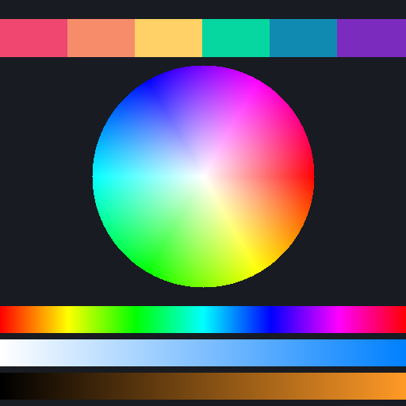

# sml-color

Pure Standard ML color-space math: RGB/RGBA, HSV, HSL, sRGB gamma, 32-bit
packing, and hex parsing/printing — **no FFI, no external dependencies**, and
byte-identical under both [MLton](http://mlton.org/) and
[Poly/ML](https://www.polyml.org/).

Everything is a total, deterministic function over reals in `[0, 1]` (hue in
degrees), so conversions and round-trips behave identically on both compilers.



*Generated by [`examples/wheel.sml`](examples/wheel.sml) (`make example`): a
`hsvToRgb` color wheel, a `fromHex` palette strip, and hue / saturation / value
ramps, encoded to PNG via the vendored `sml-image`.*

## Status

- 136 assertions, green on MLton and Poly/ML.
- Basis-library only; deterministic across compilers.

## Install

With [`smlpkg`](https://github.com/diku-dk/smlpkg):

```
smlpkg add github.com/sjqtentacles/sml-color
smlpkg sync
```

Include the MLB from your own:

```
local
  $(SML_LIB)/basis/basis.mlb
  lib/github.com/sjqtentacles/sml-color/color.mlb
in
  ...
end
```

This brings `structure Color` into scope.

## Quick start

```sml
(* HSV <-> RGB *)
val red = Color.hsvToRgb { h = 0.0, s = 1.0, v = 1.0 }
val { h, s, v } = Color.rgbToHsv { r = 0.2, g = 0.4, b = 0.6 }

(* gamma *)
val linear = Color.srgbToLinear 0.5      (* ~0.214 *)

(* pack to 0xRRGGBBAA and back *)
val word = Color.pack { r = 1.0, g = 0.0, b = 0.0, a = 1.0 }   (* 0xFF0000FF *)
val same = Color.unpack word

(* hex *)
val SOME c = Color.fromHex "#f00"        (* 3/4/6/8-digit, '#' optional *)
val s = Color.toHex c                    (* "#ff0000ff", canonical lowercase *)

(* interpolation *)
val grey = Color.mix ( { r=0.0,g=0.0,b=0.0,a=1.0 }
                     , { r=1.0,g=1.0,b=1.0,a=1.0 }, 0.5 )
```

## What's inside

| Group | Functions |
| --- | --- |
| Types | `rgb`, `rgba`, `hsv`, `hsl`, `lab`, `lch` (records of reals) |
| Clamp | `clampRgb`, `clampRgba`, `rgbToRgba`, `rgbaToRgb` |
| Conversions | `rgbToHsv`, `hsvToRgb`, `rgbToHsl`, `hslToRgb` |
| CIELAB | `toLab`, `fromLab`, `toLch`, `fromLch`, `labToLch`, `lchToLab` |
| Difference | `deltaE76`, `deltaE2000`, `deltaE` (sRGB CIE76) |
| Gamma | `srgbToLinear`, `linearToSrgb`, `rgbToLinear`, `rgbToSrgb` |
| Packing | `pack`, `unpack` (`Word32`, order `0xRRGGBBAA`) |
| Hex | `fromHex`, `toHex`, `toHexRgb` |
| Interpolation | `lerp` (unclamped), `mix` (clamps `t`) |
| Comparison | `approx`, `approxRgb`, `approxLab` |

### CIELAB and color difference

`toLab` / `fromLab` convert between sRGB and CIE L\*a\*b\* using the standard
sRGB linearization, the sRGB→XYZ matrix and the D65 white point
`(Xn, Yn, Zn) = (0.95047, 1.0, 1.08883)`. `toLch` / `fromLch` give the
cylindrical form (lightness, chroma, hue in degrees). `deltaE` measures the
perceptual difference between two sRGB colors with CIE76 (Euclidean distance
in Lab); `deltaE76` and `deltaE2000` operate directly on `lab` values.

```sml
val red = Color.toLab { r = 1.0, g = 0.0, b = 0.0 }   (* ~(53.24, 80.09, 67.20) *)
val d   = Color.deltaE ( { r=0.0,g=0.0,b=0.0 }
                       , { r=1.0,g=1.0,b=1.0 } )        (* ~100.0 *)
```

### Conventions

- Channels are reals in `[0, 1]`; hue in degrees `[0, 360)` (wrapped on input).
- Achromatic colors (`s = 0`) report a canonical hue of `0`.
- `pack` clamps to `[0, 1]` and rounds to the nearest byte.
- `fromHex` accepts `#rgb`, `#rgba`, `#rrggbb`, `#rrggbbaa` (leading `#`
  optional, case-insensitive); malformed input returns `NONE`.
- `toHex` always emits canonical lowercase `#rrggbbaa`.

## Build & test

```
make test        # MLton
make test-poly   # Poly/ML
make all-tests   # both
make clean
```

## License

MIT — see [LICENSE](LICENSE).
